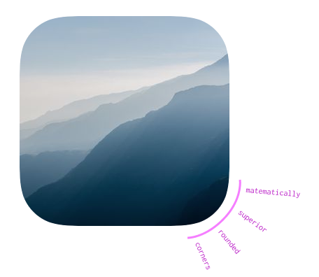

# react-bezier-mask

>

[](https://www.npmjs.com/package/react-bezier-mask) [](https://standardjs.com)




## Description


A ReactJS component that provides a mask using Bezier curves. There's a great article on [HackerNoon](https://hackernoon.com/apples-icons-have-that-shape-for-a-very-good-reason-720d4e7c8a14) about the significance of using Bezier curves for corners.


## Demo

https://wle8300.github.io/react-bezier-mask/

## Install

```bash
npm install --save react-bezier-mask
```


## Usage

```jsx
import React, { Component } from 'react'

import Mask from 'react-bezier-mask'


class Example extends Component {
  render () {
    return (
      <Mask>
        
      </Mask>
    )
  }
}
```

## TODO

- use a solution that doesn't rely on CSS `-webkit-mask` to promote browser compatibility

## License

MIT © [wle8300](https://github.com/wle8300)
